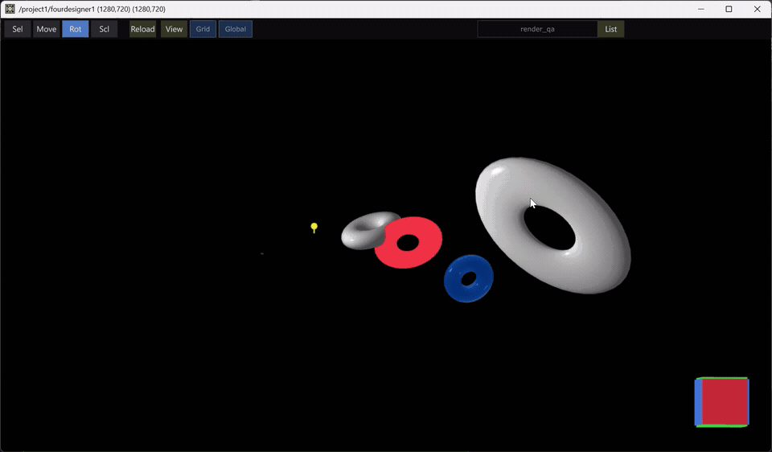

<div align="center">
  
  <h1>4designer</h1>
  <p><strong>Edit your TouchDesigner 3D scene from a browser — like Blender, but the render stays live.</strong></p>
  <p>
    <a href="#see-it-in-action">Demo</a> ·
    <a href="#quick-start">Quick start</a> ·
    <a href="#the-two-modes">Modes</a> ·
    <a href="#shortcuts">Shortcuts</a> ·
    <a href="docs/RUNBOOK.md">Runbook</a>
  </p>
  <p>
    
    
    
    
  </p>
</div>

<br />

## See it in action

<div align="center">

[](docs/demo.mp4)

<sub>▶ **[Watch the full-quality video](docs/demo.mp4)** · Outliner on the left, gizmos in the middle, live TD render in the corner. Nothing was saved, reloaded, or re-cooked by hand.</sub>

</div>

<br />

## Why

TouchDesigner is ridiculously powerful and, let's be honest, a bit of a nightmare for moving objects around. Nudging a geo means hunting parameters in a spreadsheet-ish dialog while your scene sits somewhere off-screen.

4designer puts your TD 3D world in a browser tab: click an object, drag a gizmo, watch the actual TouchDesigner render change in the same second. No save, no reload, no export dance.

- **Feels like Blender** — outliner, inspector, transform gizmos, orbit camera, undo.
- **Stays TouchDesigner** — your transforms land on real Object COMPs / Marshal CHOPs at cook time.
- **Zero round-trip** — drag, and the render moves. That's the whole trick.

## Quick start

Never touched this repo before? You need three things: a Python venv, a built UI, and one `.tox` dropped in your project. Ten minutes, tops.

### 1. Install the deps

You'll need **Python 3.11**, **Node 20+**, and TouchDesigner 2025.

```powershell
git clone https://github.com/QaAudio/4designer.git
cd 4designer

# the daemon (Python) — this is the brain
cd daemon
py -3.11 -m venv .venv
.venv\Scripts\pip install -r requirements.txt

# the UI (Vue) — build it once, the daemon serves it
cd ..\frontend
npm install
npm run build
```

That's it. You don't have to start anything by hand — TouchDesigner will launch the daemon for you in the next step.

### 2. Drop the tox in your project

Open your `.toe` and drag **`tox/fourdesigner.tox`** into the network. Then, on that COMP:

| Do this | Why |
|---------|-----|
| Check **Daemon Dir** points at *your* `daemon/` folder | ⚠️ See below — this is the one thing beginners get wrong |
| Pulse **Ensure Daemon** | Starts the Python daemon (Status should say `daemon running`) |
| Pulse **Open UI** | Opens the browser at `http://127.0.0.1:9983` |

> **⚠️ The Daemon Dir gotcha**
>
> The tox remembers the path of whoever exported it. On your machine it must be the absolute path
> to *this* clone's `daemon/` folder — for example `C:\dev\4designer\daemon` — the folder that
> contains `.venv\`. If it's wrong, **Ensure Daemon** fails with `venv python not found: …` in the
> Status field. Fix the path, pulse again.
>
> While you're there: make sure the COMP's Global OP Shortcut is `fourdesigner` (Common page).

### 3. Play

The browser opens in **Render** mode with the preview panel already up.

1. Pick your Render TOP in the toolbar field (e.g. `/project1/render1`) and hit Enter.
2. Click an object in the Outliner, press **`G`**, and drag.
3. Watch the preview. Congratulations, you're editing TouchDesigner from Chrome.

Want a cheap live proxy object instead of a full render? Pulse **Create Marshal** on the hub and grab it in the Outliner.

### If something looks off

| Symptom | Fix |
|---------|-----|
| `venv python not found` in Status | **Daemon Dir** is pointing somewhere else — see the gotcha above |
| Blank white page at `:9983` | The UI wasn't built: `cd frontend && npm run build` |
| `port busy (not 4designer)` | Something else owns **9983**; free it or change **Daemon URL** |
| Daemon LED green, TD LED grey | The hub isn't connected — pulse **Ensure Daemon** again |
| Nothing in the Outliner | You're in Render mode with no Render TOP picked, or the scene has no geos |

Deeper setup, Palette install, and tox re-export: [docs/RUNBOOK.md](docs/RUNBOOK.md) · [tox/README.md](tox/README.md).

## The two modes

| Mode | What you get | State |
|------|--------------|-------|
| **Render** | Your real geos, lights and cameras from a Render TOP, with a live JPEG preview | **stable**, default |
| **Marshaled** | Lightweight box proxies you push transforms into (Out POP) | **beta** |

Both live behind the segmented control in the top bar. **Load meshes** is an opt-in button that pulls real geometry into the viewport when you want beauty over speed — it never fires on its own.

Also worth knowing: **Auto-refresh** (the amber *Auto* chip) quietly keeps the scene list in sync, the preview window is draggable and resizable, and the little axis widget bottom-right snaps your view.

## Shortcuts

| Key | Action |
|-----|--------|
| `G` / `R` / `S` / `T` | Grab / Rotate / Scale / Translate |
| `[` / `]` | Toggle Outliner / Inspector |
| `P` | Toggle the render preview |
| `Ctrl+Z` / `Ctrl+Shift+Z` | Undo / Redo |

## How it hangs together

Three pieces, one port:

**TouchDesigner** (the `fourdesigner` hub COMP) ⇄ **daemon** (Python, `:9983`) ⇄ **browser UI** (Vue + Three.js).

Transforms travel on a fast shared-memory channel so dragging feels instant; big things like scene lists, meshes and preview frames go over plain HTTP. One daemon can serve several TouchDesigner instances at once — pick one in the workspace dropdown. The gory details live in the [runbook](docs/RUNBOOK.md#live-transport-shm).

## Contributing / hacking

```powershell
pwsh scripts/check.ps1     # the whole gate: version, Python tests, typecheck, Playwright

cd frontend && npm run build       # vue-tsc + vite
cd frontend && npm run test:e2e    # Playwright, no live TD needed
cd daemon && .venv\Scripts\python -m unittest discover -s . -p "test_*.py" -q
```

UI conventions live in [`frontend/docs/ui-design-system.md`](frontend/docs/ui-design-system.md); everything operational (tests, tox export, perf notes, what's deliberately out of v1) is in [`docs/RUNBOOK.md`](docs/RUNBOOK.md).

## License

MIT — see [LICENSE](LICENSE).
