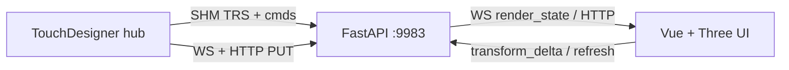

<div align="center">
  
  <h1>4designer</h1>
  <p><strong>Wire POP geometry → drag in the browser → TouchDesigner cooks at frame rate.</strong></p>
  <p>A dark, amber-accented web plate for Marshal proxies and live Render TOP scenes.</p>

  <p>
    <a href="#quick-start">Quick start</a> ·
    <a href="docs/RUNBOOK.md">Runbook</a> ·
    <a href="frontend/docs/ui-design-system.md">Design system</a> ·
    <a href="#core-workflows">Workflows</a>
  </p>
  <p>
    
    
    
    
    
    
    
  </p>
</div>

> **v1.0.0** — Render mode is stable (default). Marshaled mode stays in **beta**. Version SoT: [`VERSION`](VERSION).

<br />

<p align="center">
  
</p>
<p align="center"><sub>Render mode is the default. Auto-refresh keeps the plate honest; drag preview borders to resize. Regen a live PNG with <code>npm run capture:readme</code>.</sub></p>

## What it does

TouchDesigner networks are powerful — and awkward to edit from a browser. 4designer is a **Blender-like plate** synced to a live `.toe`:

- **Edit from a browser tab** — Outliner, Inspector, viewport gizmos, and a corner orientation helper over HTTP **:9983**.
- **Keep TD cooking live** — translate/rotate/scale lands on Object COMPs / Marshal CHOPs at cook time.
- **No save round-trip** — drag a gizmo; the Out POP / geo moves. Mesh rebuild stays opt-in.

Health check: `{"app":"4designer"}` on [http://127.0.0.1:9983](http://127.0.0.1:9983).

## Quick start

```text
# one-time venv
cd daemon
py -3.11 -m venv .venv
.venv\Scripts\pip install -r requirements.txt

# build UI
cd ../frontend
npm i
npm run build

# run daemon
cd ../daemon
.venv\Scripts\python -m fourdesigner_daemon
```

Then in TouchDesigner:

1. Drop `tox/fourdesigner.tox` (Global OP Shortcut **`fourdesigner`**).
2. Pulse **Create Marshal** → **Ensure Daemon** → **Open UI**.
3. Open [http://127.0.0.1:9983](http://127.0.0.1:9983) — you land in **Render** with the preview open.

Deep TD setup and tox export: [docs/RUNBOOK.md](docs/RUNBOOK.md). Tox notes: [tox/README.md](tox/README.md).

## View modes

| Mode | Add | Gain |
|------|-----|------|
| **Render** (default, **stable**) | Pick a Render TOP | Geo + lights + cameras plate; JPEG preview; Auto-refresh |
| **Marshaled** (**beta**) | Create a Marshal | Cheap AABB proxies; live TRS into POP Out |
| **Beauty meshes** | Load meshes | Opt-in capped GLB for geos (never on every Refresh) |

```text
AppBar  [workspace]  Marshaled | Render  [undo] [settings] [LEDs]
  └─ Outliner (~12%) | Viewport + glass toolbar + ViewHelper + preview | Inspector (~14%)
```

## Core workflows

### Create a Marshal

Hub pulse **Create Marshal**, or drag `tox/marshal.tox` from the Palette. Select it in the Outliner → `G` grab → verify the Out POP moves.

### Switch to Render

AppBar segmented control (or cold-load — Render is default). Pick a `renderTOP`, or type `/project1/render1` and Enter.

### Toggle Auto-refresh

Toolbar **Auto** chip (amber when on). Debounces scene Refresh ~750ms after commits and on a quiet poll — metadata only, never Load meshes. Identical plates are a **no-op** (selection and undo stay put). Turn off to get the manual **Refresh** button back.

### Resize the preview

Monitor icon / **`P`** shows the JPEG overlay (open by default). Drag window borders; corner + **Shift** = free aspect. Size and position persist.

### Orient the plate camera

Bottom-right **ViewHelper** (X / Y / Z) mirrors the editor OrbitControls camera. Click an axis to snap the view; drag elsewhere in the viewport to orbit/pan/zoom. This does **not** edit TD Camera COMPs.

### Load beauty meshes

**Load meshes** stays manual even with Auto on (ghost button). Caps and fingerprints live in the [runbook](docs/RUNBOOK.md#view-modes-marshaled--render).

| Shortcut | Action |
|----------|--------|
| `G` / `R` / `S` / `T` | Grab / Rotate / Scale / Translate gizmo |
| `[` / `]` | Toggle Outliner / Inspector |
| `P` | Toggle Render TOP preview |
| `Ctrl+Z` / `Ctrl+Shift+Z` | Undo / Redo |

## Architecture



Hot path: shared-memory TRS slots + command doorbells. Large payloads (scene JSON, GLB, JPEG) stay on HTTP. Details: [Live transport (SHM)](docs/RUNBOOK.md#live-transport-shm). Multi-TD workspaces: [runbook](docs/RUNBOOK.md#multi-td-workspaces).

## Development

Local gate (version + unittest + typecheck + Playwright):

```text
pwsh scripts/check.ps1
```

```text
cd frontend
npm run build          # vue-tsc + vite
npm run test:e2e       # Playwright suite (builds first; no live TD)
npm run capture:readme # live PNG → docs/img/fourdesigner-hero.png (daemon must be up)

cd ../daemon
.venv\Scripts\pip install -r requirements.txt   # includes editable ../shm
.venv\Scripts\python -m unittest discover -s . -p "test_*.py" -q
```

E2E specs (daemon+frontend): `smoke`, `render`, `transform`, `ws`, `workspaces`, `undo`, `empty`.  
Python modules: `test_state`, `test_proxy_store`, `test_render_store`, `test_workspaces`,
`test_delete_prune`, `test_shm_buf`, `test_shm_wire`, `test_v1_stability`, `test_orphan_debounce`.

UI chrome rules: [`frontend/docs/ui-design-system.md`](frontend/docs/ui-design-system.md).  
Maintainer ops (tox, checklist, deferred, perf): [`docs/RUNBOOK.md`](docs/RUNBOOK.md).

## License

MIT
