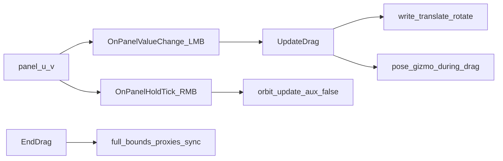

# Performance

Curated hot-path audit for 4designer. Optimization patches should land **after**
re-running the offline benches below and beating the recorded baselines.

This is not a cook-time / TouchDesigner e2e profile. Live `computeBounds` and
Render TOP lock behavior stay out of scope until a later TD harness exists.

## Cadence map

| Source | Cadence | Entry |
|--------|---------|--------|
| `panel_exec` | Value Change only (`whileOn=False`) | `FourdesignerExt.OnPanelValueChange` |
| `panel_hold_exec` | Every frame while RMB/MMB held (`whileOn=True`) | `FourdesignerExt.OnPanelHoldTick` |
| Discover / mode / selection change | Burst | `Discover`, `_sync_gizmo_to_selection`, `_wire_*` |
| Idle | After gesture | `Lock` on `render_edit` / `render_gizmo` / `render_orient` |

Orbit/pan continuous ticks were slimmed: hold path uses plain `u`/`v` + Relative
UV, and `_apply_orbit_camera(aux=False)` skips gizmo rescale / proxy scan.
LMB drag mid-gesture now uses `_pose_gizmo_during_drag` (no overlay/proxies);
full sync + bounds refresh run on `EndDrag`.



## Ranked findings

| Rank | Hot path | Anchor | Why it hurts | Status |
|------|----------|--------|--------------|--------|
| 1 | Per-sample full sync on drag | `UpdateDrag` → overlay/proxies | Every UV tick posed + bounds | **Done** — light pose mid-drag; burst on EndDrag |
| 2 | Full-scene bounds on pick | `_pick_hits_at` → `_refresh_object_bounds()` | Refreshes **all** Objects | **Deferred** (unsafe without epoch / InvalidateBounds) |
| 3 | Double gizmo feedback | `_rescale_gizmo` + callers | Double `_refresh_gizmo_feedback` | **Done** — `feedback=` flag |
| 4 | Linear object lookup | `_object_entry` | Scans Objects list | **Done** — `ObjectsByPath` |
| 5 | Unlock on mere rollover | `OnPanelValueChange` | Three Render TOPs cook while hovering | **Done** — `_any_render_locked()` |
| — | Orbit hold tick | `OnPanelHoldTick` | Already mitigated; keep as regression | OK |

## Mockable vs TD-only

| Offline (unit / mock) | Needs real TD |
|-----------------------|---------------|
| `gizmo_math` Vec3 hit math (`ray_vs_aabb`, planes, discs, closest-t, snap scalar, `gizmo_screen_scale`) | `computeBounds` |
| Fake-matrix `camera_basis` / `unproject_ray` / handle hit loops | `setTransform`, cook graph, `op.lock` |
| Drag-loop **structure** with/without overlay sync cost (stubs) | Discover / proxy SOP build / Render TOP `geometry` wiring |
| | Panel Execute whileOn vs Value Change scheduling |

## Optimization backlog

Ordered for expected FPS impact on interaction:

1. ~~Slim drag tick~~ — **shipped** (`_pose_gizmo_during_drag`, fail-open sync)
2. Dirty-only bounds on pick — **deferred**: anim / undo / SOP deform / parented-child false negatives need epoch + `InvalidateBounds` + mismatch debug before this is safe
3. ~~Deduplicate `_refresh_gizmo_feedback` after rescale~~ — **shipped**
4. ~~Avoid Unlock on hover-only samples when unlocked~~ — **shipped** (`_any_render_locked`)
5. Discover: incremental proxy rebuild instead of destroy-all — still open (burst-only)

Also deferred: EndDrag dirty-only bounds; mid-drag overlay throttle (EndDrag-only cages are the safe default).

## Offline benches

```bash
pip install -e ".[dev]"
pytest tests/unit -q
pytest tests/bench --benchmark-only --benchmark-sort=mean
```

### Baseline means

Recorded 2026-07-30 (Windows, pytest-benchmark, mean) after safe interaction optime.

| Benchmark | Mean | Notes |
|-----------|------|-------|
| `test_bench_ray_vs_aabb_64` | 28.9 µs | 64 AABB ray picks |
| `test_bench_ray_vs_aabb_256` | 114.4 µs | 256 AABB ray picks |
| `test_bench_pick_hits_after_bounds` | 162.1 µs | 128 boxes + light bounds stand-in |
| `test_bench_drag_math_only` | 179.4 µs | 120 axis-drag math samples |
| `test_bench_drag_light_pose` | 186.6 µs | math + cheap gizmo-tx stand-in (post-optime) |
| `test_bench_gizmo_screen_scale` | 221.0 µs | 500 scale evals |
| `test_bench_closest_t_and_plane` | 421.5 µs | 200 closest-t + plane hits |
| `test_bench_drag_with_overlay_sync` | 19.7 ms | anti-pattern baseline (keep) |

Finding #1 signal: light-pose tick ≈ math-only (~187 µs vs ~179 µs); overlay-sync anti-pattern remains ~**100×** slower (~19.7 ms).

Live matrix (`tests/live_optime_smoke.py` on `4designer_test`): mid-drag overlay/proxies/full-sync = 0; Local rotate pose tracks; pick/hover/orbit/fail-open PASS.

## Related source

- [`td/gizmo_math.py`](../td/gizmo_math.py) — pure hit math
- [`td/fourdesigner_ext.py`](../td/fourdesigner_ext.py) — panel / drag / discover
- [`td/panel_hold_callbacks.py`](../td/panel_hold_callbacks.py) — slim RMB/MMB whileOn
- [`tests/`](../tests/) — unit + mock benches + live smoke
